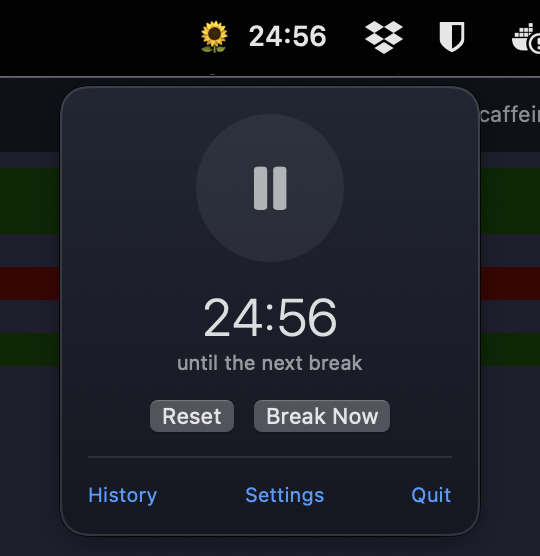
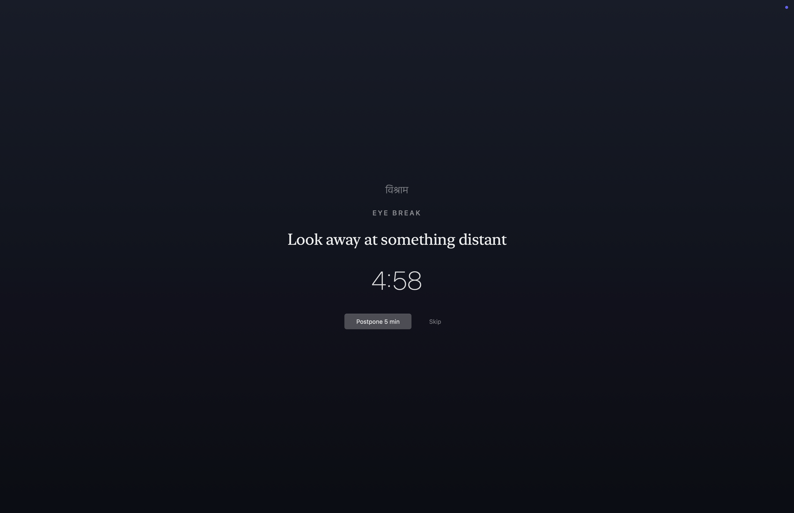
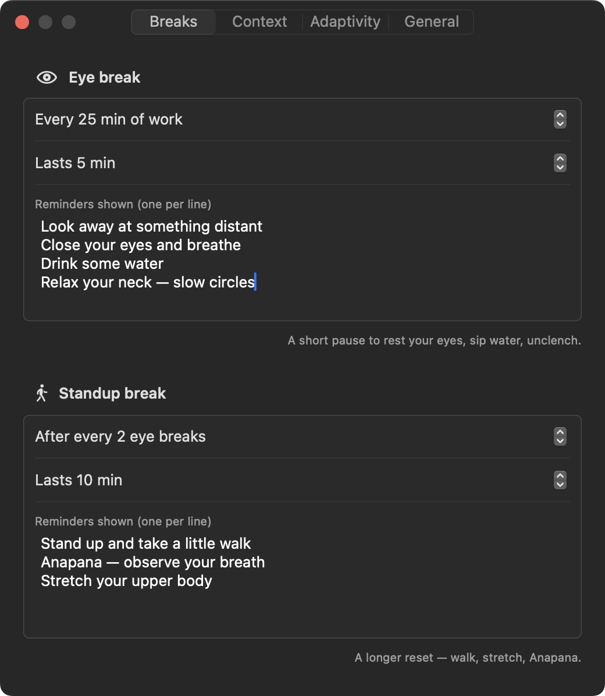
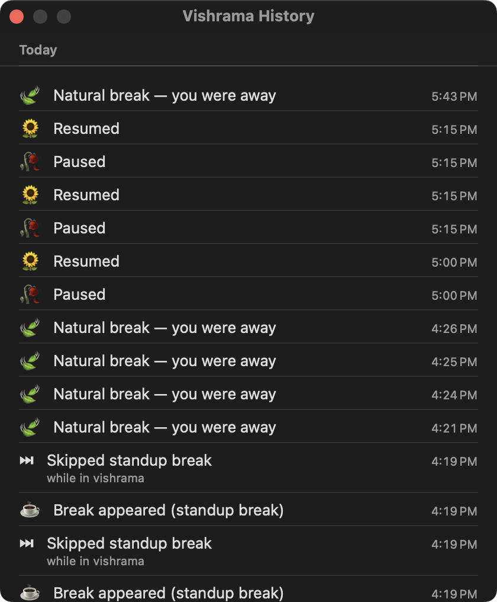

# vishrama — विश्राम

> *viśrāma* (Sanskrit): rest, repose, a pause.

A mindful, **context-aware** break reminder for macOS. Part of the same family as
[mastishka](https://github.com/NISH1001/mastishka) and [anicca](https://github.com/NISH1001/anicca).

## A glimpse

The whole app lives in the menu bar — the 🌻 is the pause button (it wilts to 🥀 while
paused), and clicking the timer opens the panel:

<p align="center">
  
</p>

When a break is due (and you're *not* in a meeting), the screen softens into this —
skippable, Esc postpones, and invisible to any screen share:



Timing and messages live together per break type, and History shows what actually
happened (breaks, skips, pauses, natural breaks while away):

<p align="center">
   
</p>

## Why

I'm a long-time fan of [Take a Break](https://apps.apple.com/us/app/take-a-break-timer-reminder/id1457158844)
by MiiDii — it's what got me into the habit of stepping away from the screen. But it has
its limits: it happily throws a full-screen overlay while you're sharing your screen in a
meeting, and skipping a break teaches it nothing. I wanted those smarts, plus far more
customizability for how *I* work — so I built vishrama.

**To be clear, vishrama is not a clone or fork.** It's written from scratch in Swift and
shares no code with (and has no affiliation to) the original — Take a Break was the
*reference for the vibe*: the menu-bar countdown, the gentle full-screen pause, the
short/long break rhythm. On top of that vibe I added the things I personally needed:
context awareness (camera/mic, screen share, calendar), adaptive backoff and flow mode,
a plain-text data format that follows me across Macs, and every knob exposed.

The result keeps the classic pomodoro-style break scheduling, but it also **knows when not
to interrupt you** (meetings, screen sharing, calendar events) and **learns from your
behavior** (skips, flow sessions) instead of nagging blindly.

## Features

- **Menu-bar native** — `🌻 24:32` in the top bar. The sunflower itself is the pause
  button (it wilts to 🥀 while paused); click the timer for a popover panel with the
  countdown, pause/play, Reset, Break Now, History, and Settings. No Dock icon.
- **Classic schedule** — an eye break every N minutes (look away, drink water, relax your
  neck); a standup break (walk, Anapana) after every K eye breaks. Everything configurable,
  including the reminder messages.
- **Full-screen break overlay** — gentle dim with the prompt, countdown, skip/postpone
  (Esc postpones). Never a cage.
- **Context awareness** *(the point of this app)*:
  - camera/mic in use → you're in a meeting → breaks wait (menu shows `⏳ +overdue`),
    then appear a polite minute after you're free
  - screen sharing / presenting → detected via helper processes and your own app list —
    and the overlay is **invisible to screen capture** as a hard guarantee
  - calendar busy (EventKit; Google accounts via macOS Internet Accounts) → breaks wait
  - idle detection → the countdown pauses when you step away; a long absence counts as
    the break itself
- **Adaptive**:
  - skip a break → it retries in 5/10/20 min (growing backoff), not a full cycle
  - three skips in 90 min → *flow mode*: 45 min of gentle notifications instead of overlays
  - **pattern learning**: it mines your last 60 days of events for contexts where you
    habitually skip (e.g. "weekday mornings in the IDE") and quietly spaces breaks out
    there — only after 8+ observations at a ≥70% skip rate, and every learned rule is
    visible in **Settings → Adaptivity** with a per-rule off switch. Nothing acts invisibly.
    Full algorithm write-up: [docs/adaptivity.md](docs/adaptivity.md).
- **History** — a humanized timeline of your last week: breaks taken, skipped, held back
  by meetings, flow sessions, pauses.
- **Yours, everywhere** — data lives in `iCloud Drive ▸ Vishrama` by default
  (`settings.json` + `events/*.jsonl`, both human-readable). Both Macs pointed at the
  same folder = one app across machines. Local-only or any custom folder also supported.
  Nothing ever leaves your own storage.

## Install

vishrama is **not signed with an Apple Developer certificate** (it's a personal,
self-signed build), so macOS Gatekeeper needs a little convincing the first time.
This is normal for indie/self-built apps — here's the full walkthrough.

### 1. Get the app into Applications

1. Download `Vishrama-x.y.z.dmg` from [Releases](https://github.com/NISH1001/vishrama/releases).
2. Open the DMG and drag **Vishrama** onto the **Applications** shortcut.
3. Eject the DMG.

### 2. Get past Gatekeeper (one time only)

Because the app isn't notarized by Apple, the first open is blocked with
*"Vishrama" Not Opened* / *"Apple could not verify…"*. Two ways through:

**The clicky way (macOS 15 Sequoia):**

1. Double-click Vishrama once — let it fail. Click **Done** (not *Move to Trash!*).
2. Open **System Settings → Privacy & Security**, scroll to the **Security** section.
3. You'll see *"Vishrama" was blocked to protect your Mac* — click **Open Anyway**.
4. Confirm with **Open Anyway** in the dialog (it may ask for your password/Touch ID).

> On macOS 13/14 the shortcut still works: **right-click Vishrama.app → Open → Open**.

**The terminal way (equivalent, faster):**

```sh
xattr -d com.apple.quarantine /Applications/Vishrama.app
```

Then open the app normally. Either way this is needed **once per downloaded copy** —
after that it launches like any other app.

### 3. First run

1. Look for **🌻 25:00** in the menu bar — that's the whole app. Click the timer for
   the panel; click the flower itself to pause/resume.
2. Allow **notifications** when prompted — flow mode uses them instead of overlays.
3. Recommended setup:
   - **Settings → General** → enable *Launch Vishrama at login*.
   - **Settings → General → Data** → keep *iCloud Drive* if you use multiple Macs
     (settings + history sync via `iCloud Drive ▸ Vishrama`).
   - **Settings → Context** → enable *Busy calendar event* if you want calendar
     awareness (macOS asks for Calendar access once).

### Updating

Download the newer DMG and drag to Applications again (replace). Settings and history
live in your data folder, not the app, so nothing is lost.

## Build from source

Requires macOS 14+ and Swift 6 (Command Line Tools are enough — no Xcode).

```sh
./scripts/build-app.sh   # swift build + assemble dist/Vishrama.app + sign + launch
./scripts/test.sh        # unit tests (Swift Testing; wraps the CLT framework paths)
```

The app is a proper `.app` bundle (`dev.nishparadox.vishrama`) so TCC permission prompts
(Calendar) work. For stable permissions across rebuilds, create a self-signed code-signing
certificate named `VishramaDev` in Keychain Access — the build script picks it up automatically.

## Architecture

```
Sources/
├── VishramaCore/   # pure logic: schedule state machine (a reducer driven at 1 Hz),
│                   # backoff/flow policy, JSONL event log — no AppKit, fully unit-tested
└── Vishrama/       # app shell: status item + popover, break overlay windows,
                    # settings/history UI, context signal providers, notifications
```

The engine is a pure function of time and context — `tick(now, context) -> [Effect]` —
so every scheduling behavior is testable with an injected clock (46 tests and counting).

## Roadmap

Pre-break heads-up notification, meeting-gap break suggestions ("meeting in 10 min —
good time for your break"), daily stats in the popover.

## License

[MIT](LICENSE)
